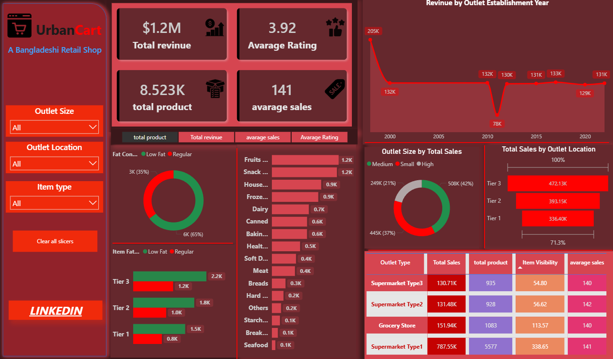

# 🛒 UrbanCart Retail Analytics Dashboard

An interactive **Power BI dashboard** built using UrbanCart grocery data to analyze sales performance, customer behavior, and outlet insights.

---

## 📊 Project Overview

This project focuses on transforming raw retail data into meaningful insights using **Power BI**.  
The dashboard helps stakeholders understand sales trends, product performance, and outlet efficiency.

---

## 🚀 Key Metrics

- 💰 **Total Revenue:** $1.2M  
- ⭐ **Average Rating:** 3.92  
- 📦 **Total Products:** 8.5K+  
- 📈 **Average Sales per Item:** 141  

---

## 🔍 Key Insights

- Medium-sized outlets generate the highest sales  
- Tier 3 locations outperform Tier 1 and Tier 2  
- Fruits and snacks are the top-selling categories  
- Low-fat items dominate product distribution  
- Sales trend shows fluctuations based on outlet establishment year  

---

## 📌 Dashboard Features

- 📅 Sales analysis by **Outlet Establishment Year**  
- 🏬 Comparison by **Outlet Size & Location**  
- 🍎 Product performance by **Item Type**  
- 🥗 Analysis of **Item Fat Content**  
- 📊 Outlet-level metrics: sales, product count, visibility  

---

## 🛠 Tools & Technologies

- **Power BI**  
- **DAX (Data Analysis Expressions)**  
- **Data Cleaning & Transformation**  
- **Data Visualization**

---

## 📷 Dashboard Preview

---

## 🔗 Project Links

- 🌐 **Live Dashboard (Power BI Service):**  
https://app.powerbi.com/view?r=eyJrIjoiNDRhYmRlOWEtNmRlYi00NzA3LThmOTgtY2NiNjEzZGY0OTZmIiwidCI6IjVjMzYwNmU0LWJlNTYtNDc3NC05Y2RmLTUwMDc3YzliZjlmZSIsImMiOjEwfQ%3D%3D

## 📁 Dataset

The dataset includes:

- Item details (type, fat content, weight, visibility)  
- Outlet information (size, location, type, establishment year)  
- Sales and rating data  

---

## 🎯 Learning Outcomes

- Improved Power BI dashboard design skills  
- Learned to create meaningful KPIs and insights  
- Practiced data storytelling with visuals  
- Gained experience in real-world retail analytics  

---

## 🙌 Feedback & Support

If you like this project, feel free to ⭐ the repo and share your feedback!

---

## 📬 Contact

- LinkedIn: https://www.linkedin.com/in/riyad-shikdar-arin-3bb348288/
